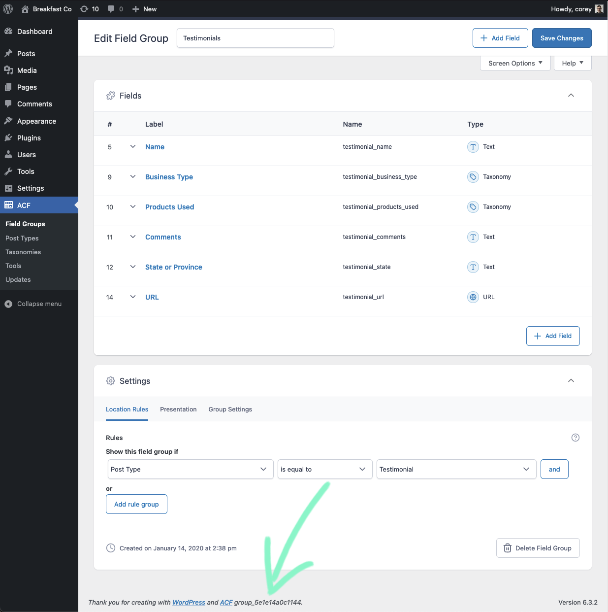
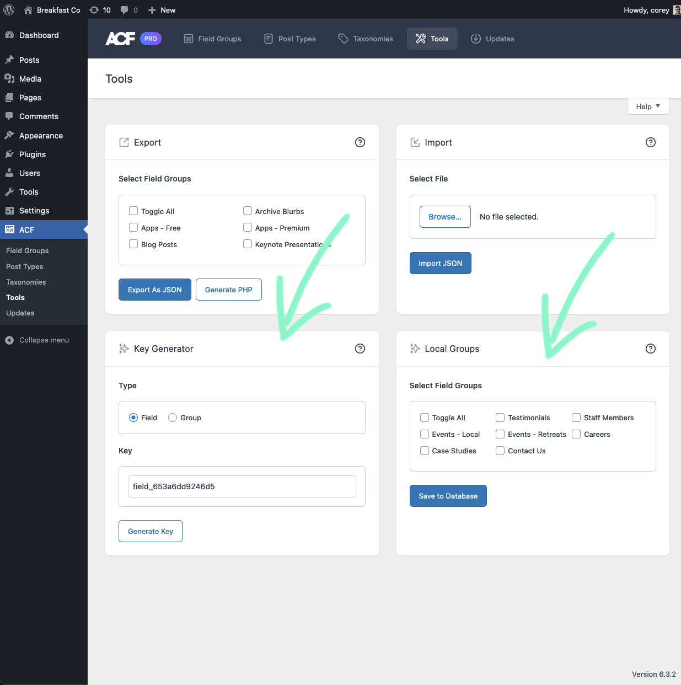

# Power Boost for ACF

WordPress plugin. Add-on for Advanced Custom Fields. ACF features I cannot live without.

## FEATURES

1. Adds the Group ID to the footer when editing a Field Group in the Dashboard.

2. Adds a Key Generator tool at ACF → Tools that generates field and group IDs.

	Field and group IDs are needed when creating or editing PHP or JSON field group files directly. ACF generates these for us when using the dashboard. To see group and field IDs in an existing field group, go to ACF → Tools → Export (or Custom Fields → Tools → Export in ACF Pro). Check any field group in the Export tool, and press the Generate PHP button.

3. Adds a Local Groups tool at ACF → Tools that saves local field groups to the database so they can be edited in the Dashboard.

## ALSO FROM THE AUTHOR

[Power Boost for Gravity Forms](https://wordpress.org/plugins/power-boost-for-gravity-forms/)